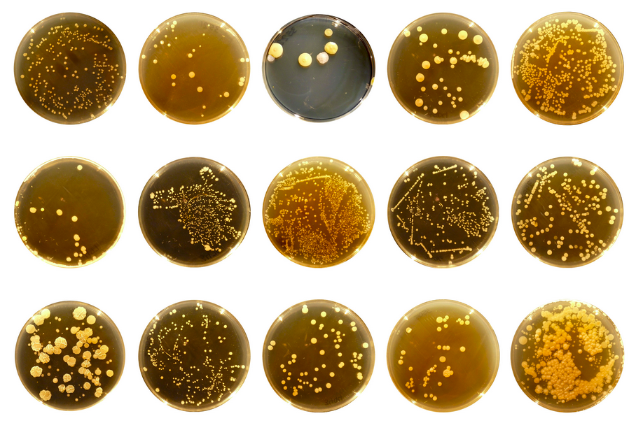
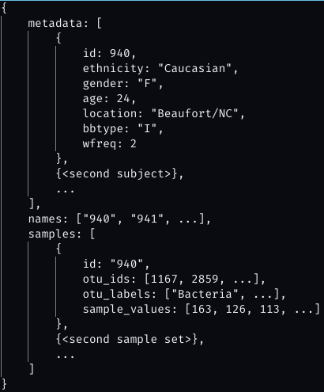
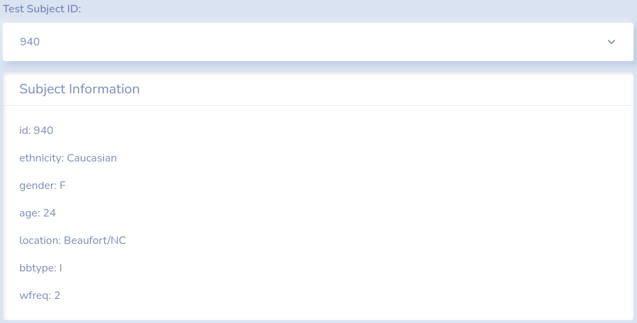
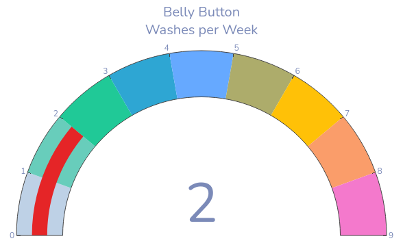
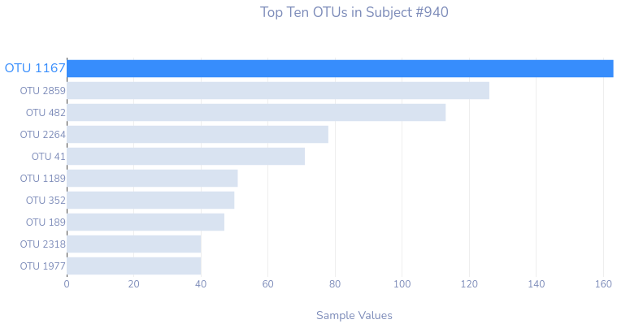
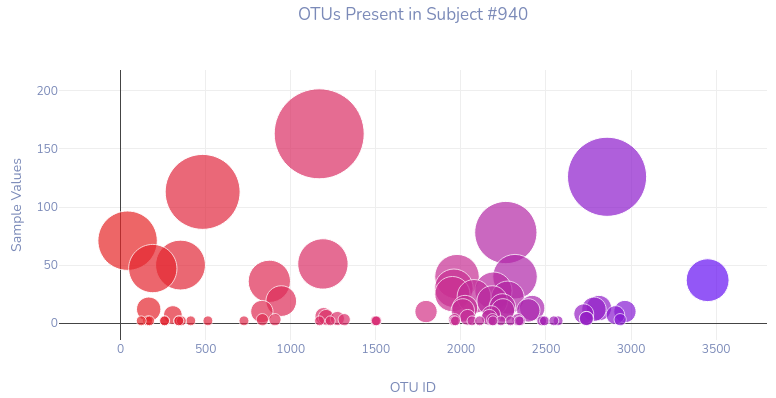

# Belly Button Biodiversity Dashboard

Charles Phil JavaScript Data Visualization Project

[Explore the dashboard here!](https://charlesphil.github.io/belly-button-biodiversity/)

## About this project

*Photo by [The Public Science Lab](http://robdunnlab.com/projects/belly-button-biodiversity/)*

The purpose of this project was to practice the loading and manipulation of data to use in exploratory web-based visualizations. The project used the [Belly Button Biodiversity](http://robdunnlab.com/projects/belly-button-biodiversity/results-and-data/) datasets from The Public Science Lab at North Carolina State University. An exploratory analysis of these navel microbes were done using the [D3](https://d3js.org/) and [Plotly](https://plotly.com/javascript/) JavaScript libraries, and the dashboard was created using the [Bootswatch Morph](https://bootswatch.com/morph/) theme, based on [Bootstrap 5](https://plotly.com/javascript/).

## Loading and accessing the data

*Photo by [Markus Winkler](https://unsplash.com/@markuswinkler?utm_source=unsplash&utm_medium=referral&utm_content=creditCopyText) on [Unsplash](https://unsplash.com/s/photos/database?utm_source=unsplash&utm_medium=referral&utm_content=creditCopyText)*

The data used for this project is contained in a JSON file hosted locally by the web page. However, D3 makes it very easy to access datasets hosted online, so there would be no difference in functionality if the data was hosted locally or somewhere else.

Once the data was obtained, attempting to parse out what the dataset contained was initially very difficult, as the JSON document was extremely convoluted. After spending a lot of time scrolling through the document, the data was structured as follows:

*JSON structure as written out by myself.*

There were three arrays contained in the object: **metadata**, **names**, and **samples**. Each item in the array was an entry related to a particular subject, with **metadata** containing an object with information about the subject, **names** being the id numbers, and **samples** containing an object with information about the subject's navel swab. With the JSON structure visualized, it was much easier to navigate through the data in order to get the information I needed in order to set up the exploratory visualizations.

Using the metadata information, I was able to populate the select menu with each subject and display the key-value pairs into a subject information card.

*Populated metadata from the dataset.*

For the sake of clarity, I also included definitions for the abbreviated terms as seen throughout the dashboard and metadata.

*Definition of terms.*

## Data visualizations

For the data visualizations, I opted for three charts as provided by the Plotly JavaScript library: 

- Angular Gauge Chart
- Horizontal Bar Chart
- Bubble Chart

I applied a responsive configuration for each chart and adjusted their colors and fonts accordingly to match with the Bootswatch theme. 

An important note to make is that with the update from Plotly JS version 1 to Plotly JS version 2, bar charts no longer default to hiding the text on top of each bar marker. Starting with version 2, the `hovertext` property must be applied in order to get a text label on hover.

### Angular Gauge Chart

With the angular gauge chart, I increased the steps of the gauge to be a maximum of 9 for all subjects. The angular gauge chart looks at the average weekly belly button wash frequency as reported by the subject, and the indicator increases or decreases to match the reported value. 

### Horizontal Bar Chart

This horizontal bar chart finds the Ten OTUs with the highest sample values or, in other words, the ten highest occurring types of microbes that appeared in the subject's sample. I made further modifications to the chart such that only the label and marker of the OTU with the largest value was colored differently from the rest of the list in order to add emphasis to that particular OTU.

### Bubble Chart

The bubble chart presents *all* the OTUs present in the subject's sample. Each circle represents a particular OTU, and the area of the circle represents the relative value compared to each other OTU. Because this is a relative measurement, I needed to adjust the sizes of each circle relative to the largest one. To accomplish this, I used a commonly used scale of `2 * Math.max(...values) / (<desired_size> ** 2)`, where `values` is the list of sample values for each OTU and the `desired_size` being the maximum desired size of the largest OTU.

## Future considerations

*Photo by [Isaac Smith](https://unsplash.com/@isaacmsmith?utm_source=unsplash&utm_medium=referral&utm_content=creditCopyText) on [Unsplash](https://unsplash.com/s/photos/graph?utm_source=unsplash&utm_medium=referral&utm_content=creditCopyText)*

Given more time, I would love to analyze if there are any correlations between the OTUs present in the samples against each detail of the individual. For example:

1. *Does your belly button type influence the amount of bacteria present in the navel?*
2. *Does a person's gender/ethnicity/age affect the types of bacteria (as categorized by OTUS) that live in a person's navel?*
3. *Is there a correlation between a person's weekly washing frequency of their navel and the amount of bacteria present? Does it affect the variety of bacteria present?*
4. *Is there a correlation between where a person lives and the kinds of bacteria that live in their navel?* 
   - *It would be interesting to see this mapped out in a geographic visualization.*
